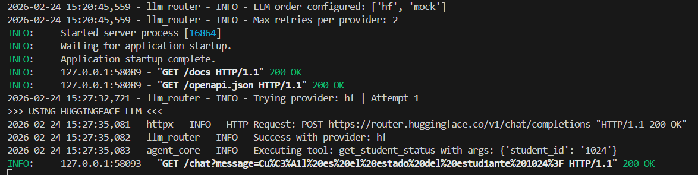
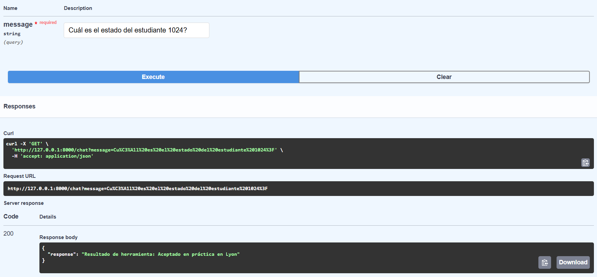
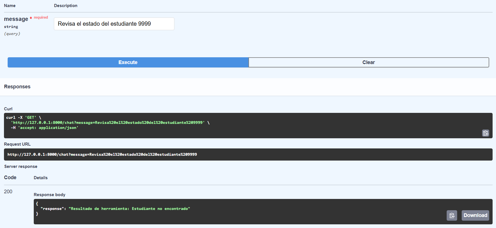
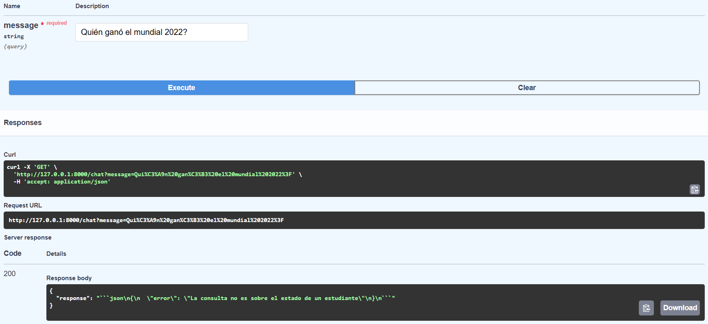

# AI Commercial Agent — Multi-Provider LLM Architecture with Fallback
## 📌 Overview

Proyecto backend que implementa un **agente LLM desacoplado con ejecución de herramientas (tool calling)** y una arquitectura resiliente basada en múltiples proveedores de modelo con:

* Retry automático por proveedor

* Fallback en cascada

* Orden configurable vía .env

* Logging estructurado

* Métricas simples de uso por proveedor

* Memoria conversacional

* Ejecución dinámica de herramientas backend

El sistema está diseñado con enfoque **production-aware**, priorizando:

* Desacoplamiento

* Resiliencia

* Configuración runtime

* Extensibilidad


## 🏗 Arquitectura General

```
Client
  ↓
FastAPI (main.py)
  ↓
AgentCore
  ↓
LLMRouter
  ↓
[ HuggingFaceLLM | MockLLM | (otros futuros) ]
  ↓
Tool Executor (si aplica)
  ↓
Business Logic (SIMULATED DB)
```

## 🧠 Componentes Clave

## 1️⃣ AgentCore

Responsable de:

* Construcción de prompts

* Gestión de memoria conversacional

* Invocación del LLM (agnóstico al proveedor)

* Detección robusta de JSON para tool-calling

* Ejecución de herramientas vía tool_executor

El agente no sabe qué modelo se usa. Solo conoce la interfaz común.

## 2️⃣ LLMInterface

Define el contrato común:

```
class LLMInterface(ABC):
    @abstractmethod
    def generate(self, system_prompt: str, user_prompt: str) -> str:
        pass
```

Cualquier proveedor debe implementar este método.

Esto permite aplicar el principio de:

>Inversión de dependencias (Dependency Inversion Principle)

## 3️⃣ LLMRouter (Resiliencia y Orquestación)

El LLMRouter implementa:

* Orden configurable vía .env

* Retry automático por proveedor

* Fallback automático

* Métricas simples de uso

* Logging estructurado

Variables configurables:

```
LLM_ORDER=hf,mock
LLM_MAX_RETRIES=2
```

Ejemplo de flujo:

```
Intento 1 → HuggingFace
Intento 2 → HuggingFace
Si falla → pasa a MockLLM
```

## 4️⃣ Tool Execution

Si el modelo responde en formato JSON válido:

```JSON
{
  "tool": "get_student_status",
  "arguments": {
    "student_id": "123"
  }
}
```

El sistema:

**1.** Detecta el JSON con regex robusta

**2.** Parsea de forma segura

**3.** Ejecuta la herramienta correspondiente

**4.** Devuelve el resultado formateado

Esto simula un patrón real de:

> LLM como orquestador + backend determinístico

## 🔄 ¿Por qué Multi-Provider en una empresa?

En entornos reales:

* Los proveedores pueden fallar

* Hay límites de cuota

* Puede haber latencia alta

* Puede requerirse cambio de proveedor por costo

* Puede requerirse modelo local por compliance

Esta arquitectura permite:

* Cambiar proveedor sin tocar el core

* Agregar fallback por resiliencia

* Probar modelos distintos en staging

* Hacer migraciones graduales

Ejemplo real:

```
Producción → OpenAI
Fallback → Azure
Emergencia → Modelo local
```

Sin modificar el agente.

## ➕ Cómo Agregar un Nuevo LLM

Supongamos que quieres agregar **OpenAI**.

### Paso 1 — Crear el proveedor

Crear archivo:

```
app/agent/openai_llm.py
```

Implementar:

```Python
from app.agent.llm_interface import LLMInterface

class OpenAILLM(LLMInterface):

    def generate(self, system_prompt: str, user_prompt: str) -> str:
        # Implementación real usando SDK de OpenAI
        return "respuesta del modelo"
```

### Paso 2 — Registrar en AgentCore

Modificar el constructor:

```Python
self.llm = LLMRouter({
    "hf": HuggingFaceLLM(),
    "mock": MockLLM(),
    "openai": OpenAILLM()
})
```

### Paso 3 — Configurar orden en .env

```
LLM_ORDER=openai,hf,mock
```

Listo.

* No se toca:

* Tool execution

* Memory

* Parsing

* API

* Router interno

## 🔧 Cómo Cambiar de Modelo en Producción

Solo cambiar en **.env** :
```
LLM_ORDER=openai
```
O:
```
LLM_ORDER=openai,hf
```

Reiniciar servicio.

Arquitectura completamente desacoplada.

## 📊 Métricas Internas

El router mantiene estadísticas simples:
```
router.get_stats()
```

Ejemplo:

```
{
  "hf": 12,
  "mock": 3
}
```

Permite detectar:

* Qué proveedor se usa más

* Si uno está fallando frecuentemente

## 🛠 Tecnologías Utilizadas

- Python 3.10+
- FastAPI
- httpx (LLM API client)
- Arquitectura basada en interfaces (Strategy Pattern)
- Logging estructurado (logging module)
- Configuración por variables de entorno (.env)

## 🎯 Qué Demuestra Este Proyecto

Este proyecto demuestra:

* Diseño desacoplado

* Principios SOLID

* Resiliencia ante fallos externos

* Tool-calling robusto

* Arquitectura extensible

* Configuración runtime

* Pensamiento orientado a producción

No se trata de un chatbot conversacional genérico.

Es un **orquestador LLM con backend determinístico y fallback resiliente**.

## 📸 Screenshots

## 🔧 Ejemplo de Ejecución de Herramientas

El agente detecta la intención, llama a la herramienta apropiada e inyecta el resultado en la respuesta.

### - Log de ejecución de herramienta



### - Búsqueda exitosa de estudiante



### - Caso de estudiante inexistente



### 🤖 Prueba de No Chatbot Genérico

El agente NO responde como un chatbot conversacional libre. Solo utiliza herramientas cuando corresponde y se limita a su dominio específico:

### - Pregunta fuera de dominio



---

## 🚀 Cómo Ejecutar

**1.** Crear entorno virtual.

**2.** Instalar dependencias:

```cmd
pip install -r requirements.txt
```

**3.** Configurar **.env**:

```
HF_API_TOKEN=Lorem_Ipsum_8f4h7kc95d6sfhj6l64ñ329

LLM_ORDER=hf,mock
LLM_MAX_RETRIES=2
```

**4.** Ejecutar:

```
uvicorn app.main:app --reload
```

## 📁 Estructura del Proyecto
```
ai-commercial-agent/
│
├── app/
│ ├── agent/
│ │ ├── agent_core.py
│ │ ├── hf_llm.py
│ │ ├── llm_interface.py
│ │ ├── llm_router.py
│ │ ├── memory.py
│ │ └── mock_llm.py
│ │
│ ├── rag/ # (Módulo en desarrollo)
│ │ ├── embeddings.py
│ │ └── vector_store.py
│ │
│ ├── tools/
│ │ ├── student_tools.py
│ │ └── tool_executor.py
│ │
│ └── main.py
│
├── data/
├── docs/
├── .gitignore
├── README.md
└── requirements.txt
```
> ⚠️ Nota: El módulo RAG (Retrieval-Augmented Generation) se encuentra en desarrollo y será activado en la rama `feature/rag-module`.  
> La versión actual en `main` implementa arquitectura multi-provider, tool calling y fallback resiliente.

## 🧩 Posibles Mejoras Futuras

* Circuit breaker pattern

* Métricas exportables (Prometheus)

* Streaming de tokens

* Persistencia de memoria en base de datos

* Feature flags por proveedor

* Rate limiting por modelo

## 📌 Conclusión

Este proyecto implementa un agente LLM modular, resiliente y configurable, capaz de integrarse con múltiples proveedores y ejecutar lógica backend determinística, siguiendo principios de arquitectura limpia y extensibilidad empresarial.
