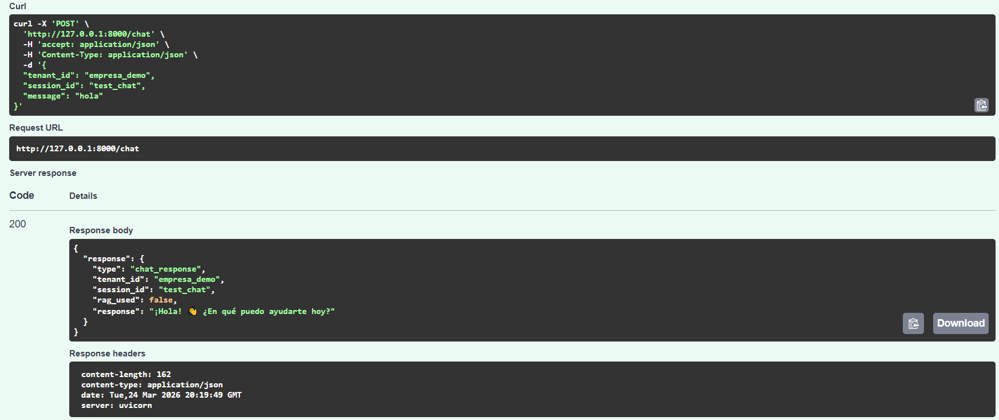
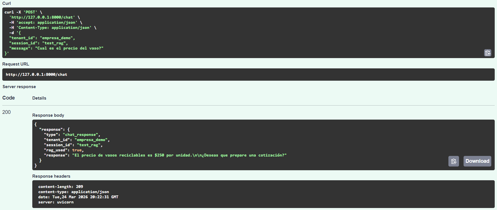
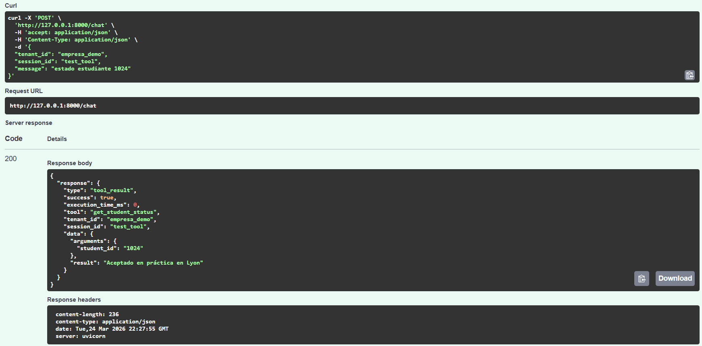
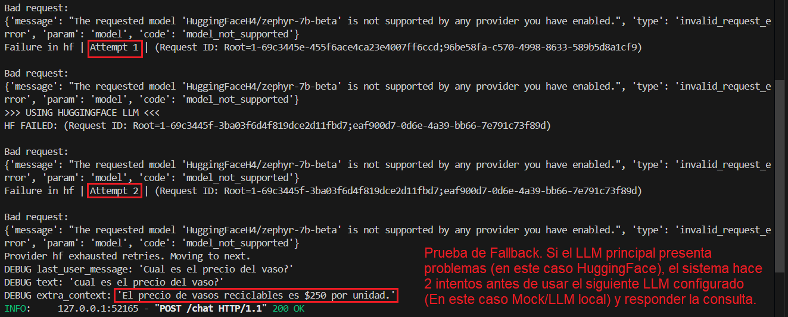

# AI Commercial Agent — Arquitectura LLM Empresarial con RAG y Orquestación de Herramientas
## 📌 Overview

AI Commercial Agent es un backend orientado a arquitectura empresarial que implementa un sistema de orquestación de modelos LLM desacoplado, resiliente y extensible.

El sistema integra:

* Enrutamiento multi-provider de LLM (con retry y fallback)

* Tool calling con ejecución determinística de backend

* Clasificación de intención (Tool vs RAG vs Direct Query)

* Módulo RAG (Retrieval-Augmented Generation) multi-tenant

* Memoria conversacional

* Respuestas con contrato estructurado

* Configuración dinámica vía .env

El sistema incluye un módulo de Recuperación-Generación Aumentada (RAG) con:

- Enrutamiento basado en intención
- Canalizaciones RAG multiusuario
- Inyección de contexto en los prompt
- Separación clara entre las capas de recuperación y generación


>Este proyecto implementa un backend de IA orientado a integración con lógica de negocio real, evitando el enfoque de chatbot genérico.

## ⚡ Demo Rápido

```
POST /chat
```
```Json
{
  "tenant_id": "empresa_demo",
  "session_id": "demo",
  "message": "Cual es el precio del vaso?"
}
```

Respuesta:

```
{
  "rag_used": true,
  "response": "El precio de vasos reciclables es $250 por unidad"
}
```

## 🏗 Arquitectura General

```
Client
  ↓
FastAPI (API Layer)
  ↓
AgentCore
  ↓
Intent Classifier
  ↓
LLMRouter (Retry + Fallback)
  ↓
[ HuggingFaceLLM | MockLLM | Otros proveedores ]
  ↓
Tool Engine (si aplica)
  ↓
RAG Pipelines / Lógica de Negocio
```
La arquitectura está diseñada con enfoque **production-aware**, priorizando:

* Desacoplamiento

* Inversión de dependencias

* Separación de responsabilidades

* Configuración runtime

* Extensibilidad

## 🧠 Componentes Principales

## 1️⃣ AgentCore

Es el núcleo de orquestación del sistema.

Responsable de:

* Construcción de prompts

* Gestión de memoria conversacional

* Clasificación de intención

* Invocación del LLM

* Inyección de contexto RAG

* Detección robusta de JSON para tool-calling

* Ejecución de herramientas vía tool_executor

* Formateo de respuestas estructuradas

El AgentCore es completamente agnóstico al proveedor de modelo.

Depende únicamente de la interfaz común ```LLMInterface```.

## 2️⃣ LLMInterface (Principio de Inversión de Dependencias)

Define el contrato obligatorio para cualquier proveedor:

```Python
class LLMInterface(ABC):
    @abstractmethod
    def generate(self, system_prompt: str, user_prompt: str) -> str:
        pass
```

Cualquier modelo (HuggingFace, OpenAI, modelo local, etc.) debe implementar este método.

Esto permite:

- Strategy Pattern

- Cambio de proveedor sin modificar el core

- Arquitectura extensible

## 3️⃣ LLMRouter (Resiliencia y Orquestación)

El LLMRouter implementa:

* Orden configurable vía .env

* Retry automático por proveedor

* Fallback en cascada

* Métricas simples de uso

* Logging estructurado

**Variables configurables** en ```.env```:

```
LLM_ORDER=hf,mock
LLM_MAX_RETRIES=2
```

Flujo de ejecución:

1. Intenta con HuggingFace

2. Reintenta si falla

3. Si excede retries → pasa a MockLLM

4. Devuelve respuesta

No se requiere modificar AgentCore para cambiar de modelo.

## 🔄 Enrutamiento Basado en Intención

Antes de invocar al modelo, el sistema clasifica la intención del usuario en:

TOOL_QUERY

RAG_QUERY

DIRECT_QUERY

Esto permite:

- Ejecutar herramientas determinísticas cuando corresponde

- Activar recuperación de contexto cuando se requiere información externa

- Evitar comportamiento de chatbot libre fuera del dominio

Este diseño separa claramente:
```
Generación de lenguaje
vs
Orquestación de lógica de negocio
```
## 📚 Módulo RAG (Implementado)

La versión 2.0 integra completamente el módulo RAG.

Incluye:

* Registro de pipelines por tenant

* Recuperación de contexto vía vector store

* Inyección de contexto en el prompt

* Separación entre retrieval y generation

```
Flujo RAG
User Query
  ↓
Intent = RAG_QUERY
  ↓
RAG Registry → Pipeline del Tenant
  ↓
Vector Search / Recuperación
  ↓
Inyección de Contexto
  ↓
Generación LLM
```

Este módulo transforma el sistema en un backend de IA con capacidad de conocimiento contextual dinámico.

## 🛠 Sistema de Tool Calling

Si el modelo responde con JSON estructurado:

```
{
  "type": "tool_call",
  "tool": "get_student_status",
  "arguments": {
    "student_id": "1024"
  }
}
```

El sistema:

* Detecta el bloque JSON con regex robusta

* Parsea de forma segura

* Ejecuta la herramienta vía Tool Engine

* Devuelve resultado estructurado

Ejemplo de resultado:

```
{
  "type": "tool_result",
  "success": true,
  "execution_time_ms": 14,
  "tool": "get_student_status",
  "data": {
    "result": "Aceptado en práctica en Lyon"
  }
}
```

Este patrón simula un entorno real donde el LLM actúa como orquestador y el backend ejecuta lógica determinística.

## 📦 Contrato de Respuesta Estructurado

Todas las respuestas siguen un formato consistente.

Respuesta Conversacional
```
{
  "type": "chat_response",
  "tenant_id": "company_a",
  "session_id": "session_001",
  "rag_used": true,
  "response": "Texto generado por el modelo..."
}
```

Resultado de Herramienta
```
{
  "type": "tool_result",
  "success": true,
  "execution_time_ms": 18,
  "tool": "tool_name",
  "data": { ... }
}
```

Este contrato permite integración directa con:

* Frontend

* Dashboards

* Sistemas de logging

* Observabilidad

* Monitoreo

## 🧩 Diseño Multi-Tenant

El sistema soporta:

* Pipelines RAG independientes por tenant

* Sesiones conversacionales aisladas

* Contextos diferenciados

* Simula una arquitectura SaaS empresarial.

## 📊 Métricas Internas

El router permite consultar estadísticas de uso:

```
router.get_stats()
```

Ejemplo:

```
{
  "hf": 15,
  "mock": 4
}
```

Permite analizar:

- Frecuencia de fallback

- Uso por proveedor

- Estabilidad del sistema

## 🔄 ¿Por Qué Multi-Provider en un Entorno Empresarial?

En producción pueden ocurrir:

* Caídas del proveedor

* Límites de cuota o rate limits

* Latencias elevadas

* Incrementos inesperados de costo

* Restricciones regulatorias o de compliance

* Necesidad de migrar hacia modelos locales

La arquitectura multi-provider implementada en este proyecto permite:

* Cambiar de proveedor sin modificar el núcleo del agente

* Agregar fallback automático para resiliencia

* Probar distintos modelos en entornos de staging

* Realizar migraciones progresivas sin reescribir lógica

* Integrar modelos locales si es necesario

Ejemplo real:

```
Producción → OpenAI
Fallback → Azure/HuggingFace
Emergencia → Modelo local
```

Todo esto sin modificar:

- AgentCore

- Tool execution

- RAG pipelines

- Memory

- API

El desacoplamiento se mantiene intacto.

## ➕ Cómo Agregar un Nuevo LLM

El AgentCore no depende de una implementación concreta de modelo.

Recibe una instancia llm que debe exponer el método:

```Python
generate(system_prompt: str, user_prompt: str) -> str
```

Esto permite integrar cualquier proveedor siempre que implemente ese contrato.

A continuación se describe el proceso para agregar un nuevo LLM.

Supongamos que quieres agregar un proveedor adicional como **OpenAI**.

### Paso 1 — Crear el nuevo proveedor

* Crear archivo:

```
app/agent/openai_llm.py
```

* Implementar la interfaz:

```Python
import openai
from app.agent.llm_interface import LLMInterface

class OpenAILLM(LLMInterface):

    def __init__(self, api_key: str):
        openai.api_key = api_key

    def generate(self, system_prompt: str, user_prompt: str) -> str:
        response = openai.ChatCompletion.create(
            model="gpt-4",
            messages=[
                {"role": "system", "content": system_prompt},
                {"role": "user", "content": user_prompt}
            ]
        )

        return response["choices"][0]["message"]["content"]
```

### Paso 2 — Registrar el Nuevo LLM

El AgentCore recibe el LLM por inyección de dependencias.

Por lo tanto, el cambio real ocurre donde construyes el sistema (normalmente en ```main.py``` o en un archivo de bootstrap).

Ejemplo en:

```
app/main.py
```

```
from app.agent.agent_core import AgentCore
from app.agent.openai_llm import OpenAILLM

llm = OpenAILLM(api_key=os.getenv("OPENAI_API_KEY"))

agent = AgentCore(
    llm=llm,
    rag_registry=rag_registry,
    intent_classifier=intent_classifier,
    tool_engine=tool_engine
)
```
No es necesario modificar ```agent_core.py```.


### Paso 3 — Configurar orden en .env

```
LLM_ORDER=openai,hf,mock
```

Listo.

* No se toca:

* Tool execution

* Memory

* Parsing

* API

* Router interno

## 🔧 Cómo Cambiar de Modelo en Producción

Solo cambiar en **.env** :
```
LLM_ORDER=openai
```
O:
```
LLM_ORDER=openai,hf
```

Reiniciar servicio.

Arquitectura completamente desacoplada.

## 🛠 Tech Stack:

- Python 3.10+
- FastAPI (API layer)
- httpx (HTTP client para LLM providers)
- Arquitectura basada en interfaces (Strategy Pattern)
- Vector Store abstraction (RAG)
- Environment-based configuration (.env)

---

## 🚀 Cómo Ejecutar el Proyecto

1️⃣ Crear entorno virtual
```
python -m venv venv
```
2️⃣ Instalar dependencias
```
pip install -r requirements.txt
```
3️⃣ Configurar .env
```
HF_API_TOKEN=tu_token_aqui
LLM_ORDER=hf,mock
LLM_MAX_RETRIES=2
```
4️⃣ Ejecutar servidor

Activar el entorno virtual:
```
venv\Scripts\activate
```

```
uvicorn main:app --reload
```
---

## Testing

El sistema puede validarse mediante la interfaz interactiva de FastAPI:

http://127.0.0.1:8000/docs

### Endpoint principal

POST /chat

### Payload de ejemplo

```
{
  "tenant_id": "empresa_demo",
  "session_id": "test_id",
  "message": "mensaje del usuario"
}
```

## 🧪 Pruebas del Sistema (Evidencia Real)

El sistema fue validado mediante distintos escenarios que reflejan comportamientos reales de un backend de IA en producción.

🔹 1. Conversación básica



Objetivo: validar respuesta conversacional sin RAG ni tools.

Resultado:

"rag_used": false
respuesta natural del asistente


🔹 2. RAG — Consulta de conocimiento



Input:

"¿Cuál es el precio del vaso?"

Resultado:

"rag_used": true
respuesta basada en knowledge base

👉 Se valida recuperación + generación.

🔹 3. RAG — Variación semántica


Input:

"precio vasos reciclables"

Resultado:

recuperación correcta sin coincidencia exacta

👉 Se valida búsqueda semántica (no keyword matching).

🔹 4. Ejecución de herramientas (Tool Calling)



Input:

"estado estudiante 1024"

Resultado:

{
  "type": "tool_result",
  "success": true
}

👉 El LLM actúa como orquestador, no como ejecutor.

🔹 5. Fallback entre proveedores LLM



Validación en logs:

Provider hf exhausted retries. Moving to next.

Resultado:

el sistema sigue respondiendo correctamente. 

**El número máximo de attempts o "tries" por seguridad se deja en 2 o 3, y se define en el archivo .env**

👉 Se valida resiliencia ante fallos externos.

---

## 📁 Estructura del Proyecto

```
ai-commercial-agent/
│
├── app/
│   ├── agent/
│   │   ├── agent_core.py
│   │   ├── llm_interface.py
│   │   ├── llm_router.py
│   │   ├── hf_llm.py
│   │   ├── mock_llm.py
│   │   ├── intent_classifier.py
│   │   └── memory.py
│   │
│   ├── rag/
│   │   ├── rag_registry.py
│   │   ├── embeddings.py
│   │   └── vector_store.py
│   │
│   ├── tools/
│   │   ├── student_tools.py
│   │   └── tool_executor.py
│   │
│   └── main.py
│
├── data/
├── docs/
├── README.md
└── requirements.txt
```

## 🎯 Qué Demuestra Este Proyecto

* Arquitectura desacoplada

* Principios SOLID aplicados

* Resiliencia ante fallos externos

* Multi-provider LLM orchestration

* Tool execution determinística

* RAG (Retrieval-Augmented Generation)

* Diseño orientado a producción

* Contratos de salida estructurados

Este proyecto no corresponde a un prototipo académico, sino a una implementación orientada a escenarios reales de integración empresarial.


## 🔮 Posibles Mejoras Futuras

* Circuit Breaker Pattern

* Exportación de métricas (Prometheus)

* Streaming de tokens

* Persistencia de memoria en base de datos

* Rate limiting por proveedor

* Observabilidad con correlation IDs

* Feature flags por tenant

## 📌 Conclusión

AI Commercial Agent evoluciona desde una arquitectura multi-provider con fallback resiliente (v1.0) hacia un backend empresarial con RAG integrado y enrutamiento inteligente por intención (v2.0).

El sistema prioriza:

* Desacoplamiento

* Extensibilidad

* Resiliencia

* Diseño orientado a producción

---

## Autor

**Pablo Amion**

Ingeniería Informática — Chile

Enfocado en:
- Arquitectura backend
- Sistemas con IA (LLMs, RAG, agentes)
- Diseño desacoplado y orientado a producción

Este proyecto forma parte de un portafolio orientado a desarrollo de sistemas de IA aplicados a entornos empresariales.

---

## Contacto

- GitHub: https://github.com/pamionj
- LinkedIn: https://www.linkedin.com/in/pamionj


